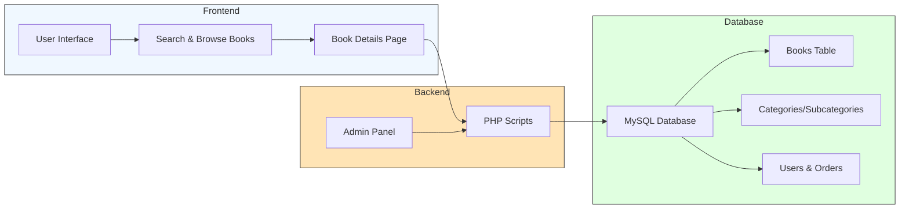

# Online Book Store Project (PHP & MySQL)

A **web-based e-book store** built using **PHP, MySQL, HTML, CSS, Bootstrap, and JavaScript**.  
This project allows users to browse and search books, view details, and see books categorized by category and sub-category. Admins can manage books through a simple backend interface.  

---

## ⚡ How It Works
- Users interact with a web interface to search or browse books.  
- PHP handles the backend logic, generates SQL queries, and fetches data from the MySQL database.  
- Books are stored in a structured database with categories, subcategories, and related tables.  
- Admins can add, edit, or remove books via the admin panel.

---

## 🛠 Tools & Technologies Used
- **Backend:** PHP  
- **Database:** MySQL  
- **Frontend:** HTML, CSS, Bootstrap, JavaScript  

---

## Project Dashboard Overview

---

### ✅ Project Summary

This Online Book Store Project is a **full-stack web application** built with **PHP, MySQL, and Bootstrap**.  

It allows users to **browse, search, and view books** organized by categories and sub-categories. Admins can **manage the book inventory** through a backend panel.  

The system demonstrates **dynamic content rendering**, **database-driven functionality**, and **frontend-backend integration**.  

It is ideal for students and beginners to learn:
- **Web development using PHP**
- **Database design with MySQL**
- **Frontend development using HTML, CSS, and Bootstrap**
- **Basic e-commerce logic and user management**

This project gives a clear overview of how a **real-world online bookstore** works from **user interaction to database management**.

